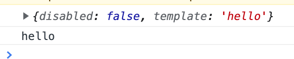
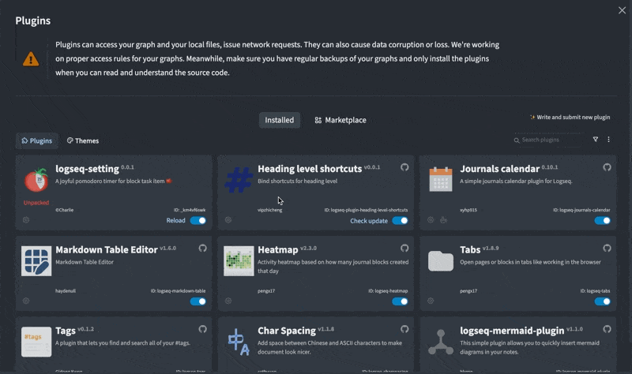

# 为logseq插件制作设置项

## 引言

在之前的内容中，我们所制做的`logseq 插件`都是固定的写死的。随着[Enhance/Settings UI of plugins](https://github.com/logseq/logseq/pull/4035)功能被合并。现在`logseq`有了插件设置的UI界面，在这之前只能通过`json`去修改设置项。可以为插件提供灵活的设置。接下来我们将做制作一个提供设置功能的插件。

## 起步

在`logseq`中，`logseq.settings`api为我们提供了从插件所属的`json`文件中读取内容的功能。而`logseq.updateSettings`则为我们提供了创建或修改插件`json`的功能。

我们通过这两个api就可以完成大部分的功能。

这次我们来创建一个插件。这个插件从用户设置中读取出`特定的内容`。我们通过`命令`往`logseq`中插入我们的`特定的内容`内容。

## 从json读取设置项

#### 往json设置默认的值。

我们用之前`随机句子`的插件加一点修改

main.ts

```typescript
  if(logseq.settings.template === undefined){ // 如果插件设置项里没有template。既可以认为第一次打开插件。这里往里面写配置项
    logseq.updateSettings({
      template:"hello",
    });
  }
	
```

**注意：我在`0.6.1`使用时，**`logseq.updateSettings`有时重载插件是没有生效的。如果出现这种情况，请重启`logseq`。重启第一次加载插件会为`logseq.updateSettings`生效。

#### 从json读取值

main.ts

```typescript
  // cosnt { template }= logseq.settings;
  // 这里不能用解构语句。因为没有babel转义js的新语法
  const template = logseq.settings.template; // 从配置项中读取
  console.log(logseq.settings);
  console.log(logseq.settings.template);
```



### 图形化的设置面板

在`logseq/lib`有`useSettingsSchema`api为我们通过`SettingSchemaDesc`类型的数组向`logseq`注册我们插件所需要的设置项的信息。然后`logseq`就可以自动的生成图形化的设置面板。

`SettingSchemaDesc`类型有哪些属性可以在[这里](https://logseq.github.io/plugins/modules.html#SettingSchemaDesc)看到。它的源码如下

```typescript
export type SettingSchemaDesc = {
  key: string
  type: 'string' | 'number' | 'boolean' | 'enum' | 'object'
  default: string | number | boolean | Array<any> | object | null
  title: string
  description: string // 支持md语法
  inputAs?: 'color' | 'date' | 'datetime-local' | 'range'
  enumChoices?: Array<string>
  enumPicker?: 'select' | 'radio' | 'checkbox' // 默认是 select
}
```

我们建立一个Arrary：

```typescript
  const schema:Array<SettingSchemaDesc> = [
    {
      key:"template",
      type:"string",
      default:"hello",
      title:"模板",
      description:"插入模板",
    },
    {
      key:"isShow",
      type:"boolean",
      default:true,
      title:"欢迎提示",
      description:"是否显示欢迎提示",
    } 
  ];
```

```typescript
  logseq.useSettingsSchema(schema)
```

效果如下



完整代码如下：

`index.ts`

```typescript
import '@logseq/libs'

async function main () {

  console.log(logseq.settings);
  if(logseq.settings.template === undefined){
    logseq.updateSettings({
      template:"hello",
      isShow:true // 这里加了一个设置项
    });
  }

  //cosnt { template }= logseq.settings;
  // 这里不能用解构语句。因为没有babel转义js新语法
  const template = logseq.settings.template;

  if(logseq.settings.isShow){
    logseq.App.showMsg('hello, Logseqer! :)')
  }

  const schema:Array<SettingSchemaDesc> = [
    {
      key:"template",
      type:"string",
      default:"hello",
      title:"模板",
      description:"插入模板",
    },
    {
      key:"isShow",
      type:"boolean",
      default:true,
      title:"欢迎提示",
      description:"是否显示欢迎提示",
    } 
  ];
  logseq.useSettingsSchema(schema)

  logseq.Editor.registerSlashCommand('statement', async () => {
    await logseq.Editor.insertAtEditingCursor(
      `#+BEGIN_QUOTE
      ${template}
      #+END_QUOTE`,
    );
    getStatement();
  })

}
logseq.ready(main).catch(console.error)
```
