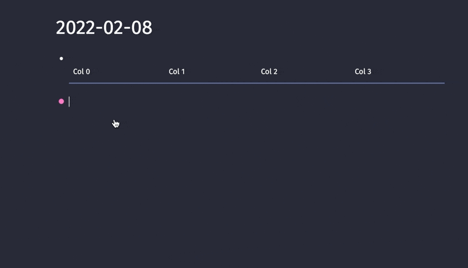
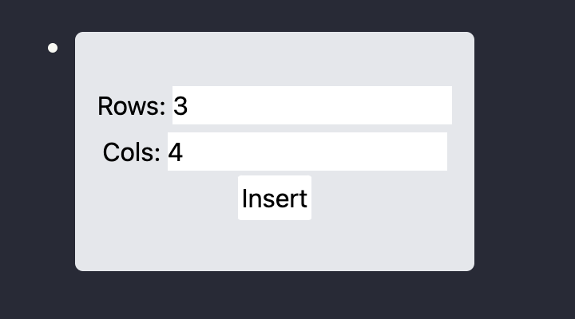
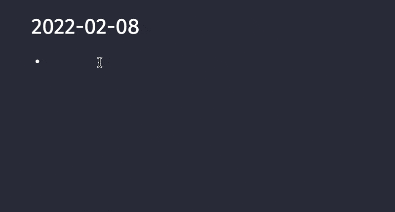

# 制作一个表格生成器

这次我们来创建一个快捷创建`markdown`的表格。当我们输入`/create table`时，显示出一个`create table`窗口，填入我们想要的`row`和`col`就往`logseq`插入我们想要的`markdown`表格。

这次项目同样基于`logseq-plugin-template-react`

## 搭建

参考上一章

## 注册命令

`main.tsx`

```typescript
 logseq.Editor.registerSlashCommand(
      'create table', async () => {
        logseq.showMainUI()
      },
  )
```

## 写窗口

新建`table.tsx`和`table.css`

```typescript
import React, {useEffect} from "react";
import "./table.css"

const createTable = (row:number, col:number)=>{ // 生成markdown表格的内容
    let content = "|"
    let rowContent = "|"

    for(let i = 0; i < col; i++){
        content += ` Col ${i} |`
    }
    content += "\n"
    content += "|"

    for(let i = 0; i < col; i++){
        content += " --- |"
    }
    content += "\n"

    for(let j = 0; j < col; j++){
        rowContent += "   |"
    }
    rowContent += "\n"

    for(let i = 0; i < row; i++){
        content +=
            rowContent
    }
    return content
}

const insertContent = async (content:string) =>{ // 把内容插入到logseq
    window.logseq.hideMainUI({ restoreEditingCursor: true });
    await window.logseq.Editor.insertAtEditingCursor(content);
    // 
}

// eslint-disable-next-line react/display-name,no-empty-pattern
export const Table = React.forwardRef<HTMLDivElement>(({}, ref) => {
    const [row, setRow] = React.useState("3");
    const [col, setCol] = React.useState("4");

    return(
        <div
            ref={ref}
            className="table-root"
            >
            <div className="center">
                <div>
                    Rows: <input value={row} onChange={(e)=>setRow(e.target.value)}/>
                </div>
                <div>
                    Cols: <input value={col} onChange={(e)=>setCol(e.target.value)} />
                </div>
                <div>
                    <button onClick={()=>{insertContent(createTable(Number(row),Number(col)))}}>Insert</button>
                </div>
            </div>
        </div>
    );
});
```

```css
.table-root {
    position: absolute;
    background-color: #e5e7eb;
    display: flex;
    width: 250px;
    height: 150px;
}

.center{
    display: flex;
    flex-direction: column;
    margin: auto;
}
```

`main.tsx`和上一章基本一样，导入的组件变了而已。

```typescript
import React, { useRef } from "react";
import { useAppVisible } from "./utils";
import { Table } from "./table";

function App() {
  const innerRef = useRef<HTMLDivElement>(null);
  const visible = useAppVisible();

  if (visible) {
    return (
      <main
        className="absolute inset-0"
        onClick={(e) => {
          if (!innerRef.current?.contains(e.target as any)) {
            window.logseq.hideMainUI();
          }
        }}
      >
        <Table ref={innerRef}  />
      </main>
    );
  }
  return null;
}

export default App;
```

现在已经能调出`create table`窗口了，但是窗口出现在`logseq`的左上角。我们要调整一下窗口出现的位置。

## 让窗口出现在光标处

这次我们希望它像`emoji-picker`一样工作。窗口在光标的地方。我们直接从那边扒代码。

修改`table.tsx`

```typescript
export const Table = React.forwardRef<HTMLDivElement>(({}, ref) => {

    const [row, setRow] = React.useState("3");
    const [col, setCol] = React.useState("4");
    const [left, setLeft] = React.useState(0);
    const [top, setTop] = React.useState(0);
    const [rect, setReact] = React.useState({top:0,left:0});

    useEffect( ()=>{
        // 获取当前光标的位置
        window.logseq.Editor.getEditingCursorPosition().then((res)=>{
            // @ts-ignore
            const {left, top, rect} = res;
            setLeft(left);
            setTop(top);
            setReact(rect);
        });
    },[])

    return(
        <div
            ref={ref}
            className="table-root"
              // 动态修改css，让位置与光标位置一致
             style={{ top: top + rect.top + 'px',
                 left: left + rect.left + 'px', }}
            >
            <div className="center">
                <div>
                    Rows: <input value={row} onChange={(e)=>setRow(e.target.value)}/>
                </div>
                <div>
                    Cols: <input value={col} onChange={(e)=>setCol(e.target.value)} />
                </div>
                <div>
                    <button onClick={()=>{insertContent(createTable(Number(row),Number(col)))}}>Insert</button>
                </div>
            </div>
        </div>
    );
});
```

效果不错!



## 美化窗口

虽然现在一个插件的基本功能做到了，但是还是很丑。我们进行一番修改。让窗口边框变的光滑，然后居中组件。

```html
            <div className="center">
                <div className="row">
                    Rows: <input value={row} onChange={(e)=>setRow(e.target.value)}/>
                </div>
                <div className="col">
                    Cols: <input value={col} onChange={(e)=>setCol(e.target.value)} />
                </div>
                <div>
                    <button className="button" onClick={()=>{insertContent(createTable(Number(row),Number(col)))}}>Insert</button>
                </div>
            </div>
```

```css
.table-root {
    position: absolute;
    background-color: #e5e7eb;
    display: flex;
    width: 250px;
    height: 150px;
    border-radius: 5px;

}

.center{
    display: flex;
    flex-direction: column;
    margin: auto;
}

.button{
    display: flex;
    margin: auto;
    border-radius: 5%;
    background-color: white;
    padding: 2px;
}
.row{
    padding: 2px;
    margin: auto;
}
.col{
    padding: 3px;
    margin: auto;
}
```



虽然现在还是很丑，但是已经比之前好很多了。

## 

## 注册快捷键

我们还希望能更方便一点。比如当我们按下`esc`时关闭窗口，按下`Enter`时就等于按下`insert`。

### `esc`实现

### 在`main.tsx`中加入`监听器`。

```typescript
  document.addEventListener('keydown', function (e) {
    if (e.keyCode === 27) {
      logseq.hideMainUI({ restoreEditingCursor: true })
    }
    e.stopPropagation()
  }, false)
```



图：通过`esc`关闭窗口

### `Enter`实现

修改`main.tsx`

```typescript
  document.addEventListener('keydown', function (e) {
    if (e.keyCode === 27) {
      logseq.hideMainUI({ restoreEditingCursor: true })
    }

    if (e.keyCode === 13) {
      // @ts-ignore
      logseq.emit('table_enter_down', e)
    }

    e.stopPropagation()
  }, false)
```

监听`Enter`事件。这里用到了`logseq`的`event`机制。通过`logseq.emit`提交事件。

在`table.tsx`组件里监听`logseq`其它地方发来的可能的监听事件。

这里之所以要`off`掉之前的事件，是因为有修改`row`或者`col`会挂载多个事件的。导致一按回车，触发多个事件。

```typescript
    useEffect(()=>{
        // @ts-ignore
        window.logseq.off("table_enter_down");

        // @ts-ignore
        window.logseq.once("table_enter_down", ()=>{
            insertContent(createTable(Number(row),Number(col)));
        })
    },[row, col])
```


现在就可以通过`esc`关闭窗口和`Enter`进行触发按扭了。

### 拓展

调整窗口位置的实现和逻辑：

代码分析与解释：未完待续

`logseq-plugin-heatmap`的实现

```typescript
function useIconPosition() {
  const windowSize = useWindowSize();
  return React.useMemo(() => {
    let right = windowSize.width - 10;
    let bottom = 20;
    if (top?.document) {
      const iconRect = top?.document
        .querySelector(`.${triggerIconName}`)
        ?.getBoundingClientRect();
      if (iconRect) {
        right = iconRect.right;
        bottom = iconRect.bottom;
      }
    }
    return { right, bottom };
  }, [windowSize]);
}
```

`useWindowSize`是`react-use`提供的`hook`，为我们提供当前窗口的大小。

这里获得right、bottom的意义不必多说。

```
if (top?.document) {
      const iconRect = top?.document
        .querySelector(`.${triggerIconName}`)
        ?.getBoundingClientRect();
      if (iconRect) {
        right = iconRect.right;
        bottom = iconRect.bottom;
      }
    }
```

这段代码的意义是

未完待续


`logseq-emoji-picker`的实现

```typescript
  logseq.Editor.registerSlashCommand(
    '😀 Emoji picker', async () => {
      const {
        left,
        top,
        rect,
      } = await logseq.Editor.getEditingCursorPosition()
      Object.assign(emojiPickerEl.style, {
        top: top + rect.top + 'px',
        left: left + rect.left + 'px',
      })
      logseq.showMainUI()

      setTimeout(() => {
        makePicker().showPicker(emojiPickerEl)
      }, 100)
    },
  )
```

`logseq.Editor.getEditingCursorPosition`获取当前光标所在位置的api。

返回值示例：

```json
{
    left: 0,
    pos: 0,
    rect: {
        bottom: 211,
        height: 25,
        left: 88,
        right: 747,
        top: 186,
        width: 659,
        x: 88,
        y: 186
    },
    top: 1
}
```

与我们窗口有关的属性在`rect`之中。

未完待续
