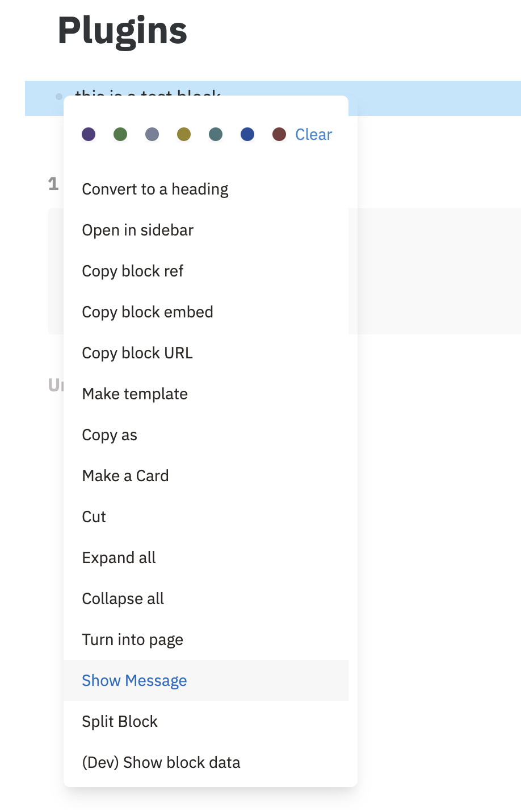
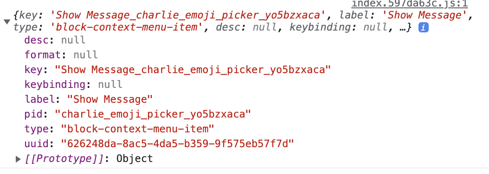
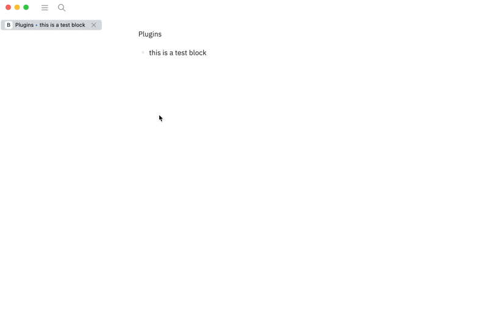

# 注册Block选项菜单

### 什么是选项菜单

在Logseq的Block左边有一个小圆点，当我们右击他的时候，会弹出一个选项菜单。我们可以进行一个命令的快速选择。

40.gif

这次我们要实现这样的一个插件。在选项菜单中加入一个选项，当我们按下它之后，为`block`加上`#favorite`标签。

### 通过`registerBlockContextMenuItem`注册选项

在`index.ts`中。

```
import '@logseq/libs'
/**
 * main entry
 */
async function main () {
  logseq.Editor.registerBlockContextMenuItem("Show Message", async (e) => {
    console.log(e)
  });
}

// bootstrap
logseq.ready(main).catch(console.error)
```



现在我们成功注册了`Context Item`。接下来我们为它加入功能。

### 编辑`Block`

`registerBlockContextMenuItem(tag: *string*, action: BlockCommandCallback): *unknown*`

`registerBlockContextMenuItem`的action是这样的。而`BlockCommandCallback`的格式是这样的`(e: IHookEvent &  uuid: BlockUUID })`

比如



接下来，我们使用`getBlock`去获得`Block`里的内容，再通过`updateBlock`去在`block`内容里面加一个`#favorite`

index.ts

```javascript
import '@logseq/libs'
/**
 * main entry
 */
async function main () {
  logseq.Editor.registerBlockContextMenuItem("Favorite", async (e) => {
    const block = await logseq.Editor.getBlock(e.uuid);
    let content = block.content;
    logseq.Editor.updateBlock(e.uuid, 
        "#favorite " + block.content
    );
  });
}

// bootstrap
logseq.ready(main).catch(console.error)
```

实际效果：



