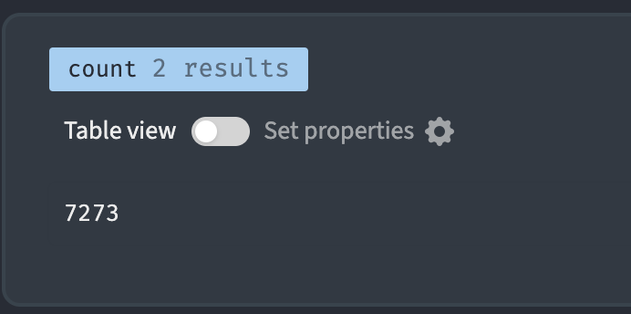
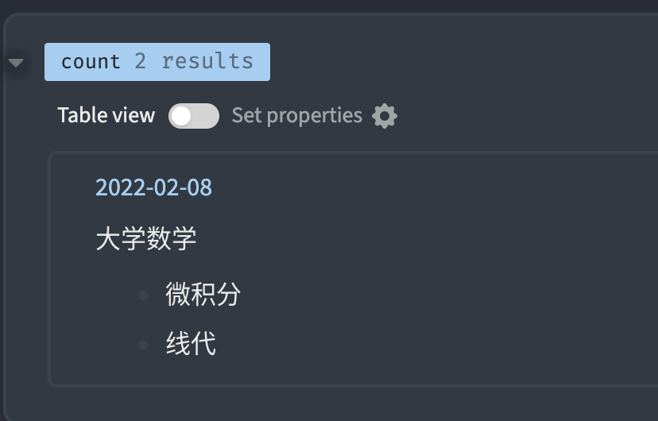
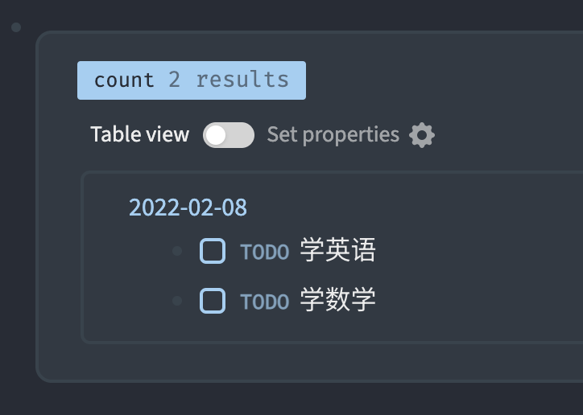
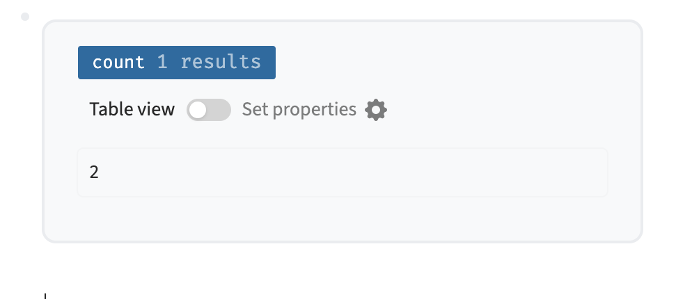
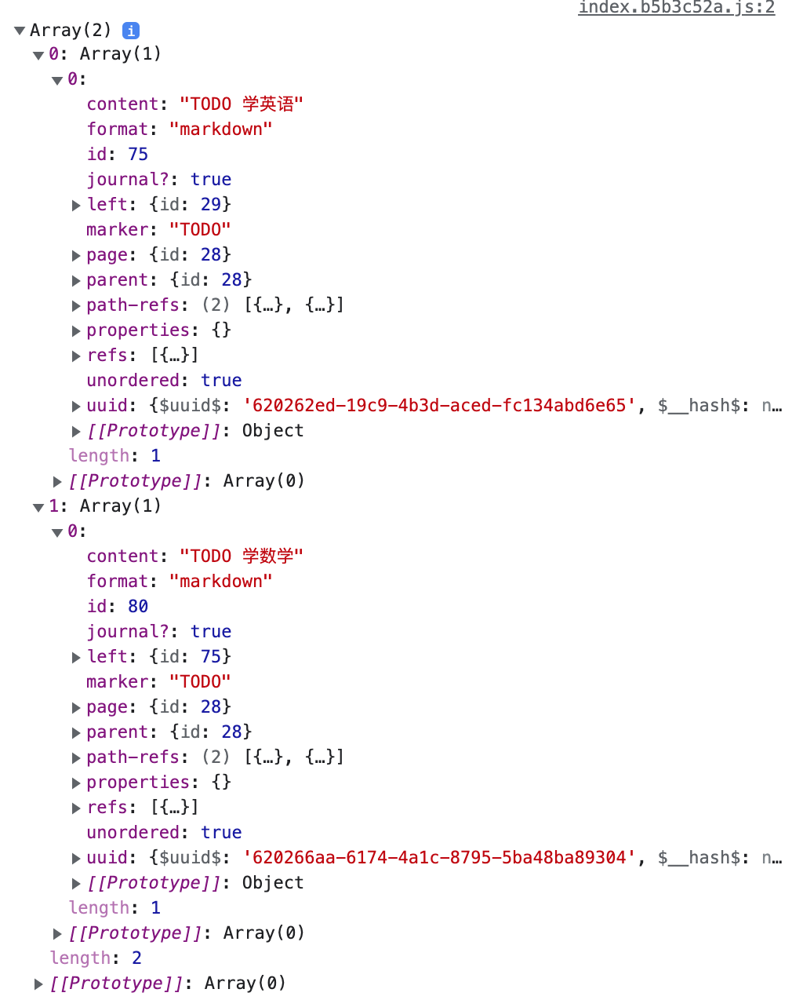

# Datascript入门

## datascript有什么用？

## 在Logseq使用

### 什么是匹配？

datascript是一种`匹配`查询的语言,我们从最简单的语句开始，一步一步提高直到学会\`datascript\`。

什么是匹配呢？我们设想`Logseq`的数据库是长这样的

| E-id | Attribute      | Value |
| ---- | -------------- | ----- |
| 50   | :block/parent  | 49    |
| 50   | :block/content | 大学数学  |
| 51   | :block/parent  | 50    |
| 51   | :block/content | 微积分   |
| 52   | :block/parent  | 50    |
| 52   | :block/content | 线代    |
| 53   | :block/parent  | 49    |
| 53   | :block/content | 大学英语  |

这个表在`Logseq`中看起来是什么样的呢？是这样。微积分和线代的父节点是大学数学。大学数学和大学英语同层级。


我们构造这个命令

```
[:find ?e 
    :where
     [?e :block/parent 50]]
```

ps：这是`datascript`的语法，在`logseq`中使用还需要加上特定的语法，例:

```
#+BEGIN_QUERY
{:title "找到父节点为50的节点"
    :query [:find ?e 
    :where
     [?e :block/parent 50]]
}
#+END_QUERY
```

`[?e :block/parent 50]`意思就是匹配所有`block`中`parent`是`50`的节点。在我们这里表里面，结果有两个，分别是`51`和`52`。那么这个`?e`就是`变量`，它的值来源于与`:block/parent 50`相匹配行的`e-id`，现在的`?e`的值是`51`、`52`。

我的logseq中微积分是72， 线代是73。

`(pull 变量名 [*])`这个`方法`的作用是把`变量名`所对应的`block`显示出来：

```
[:find (pull ?e [*])
    :where
     [?e :block/parent 50]]
```



### 

### 多个匹配条件

还可能通过多个匹配语句去选择我们想要的`block`。

现在我们假设我们有一个这样的`logseq`库。

| E-id | Attribute      | Value  |
| ---- | -------------- | ------ |
| 50   | :block/marker  | TODO   |
| 50   | :block/content | 学习英语   |
| 51   | :block/marker  | TODO   |
| 51   | :block/content | 学习数学   |
| 52   | :block/marker  | DONE   |
| 52   | :block/content | 学习语文   |
| 53   | :block/parent  | 49     |
| 53   | :block/content | 今天天气真好 |

看起来像这样


我们构造一个筛选出目前还是`TODO`的`任务`的条件语句。

```
 [:find (pull ?e [*]) 
    :where
     [?e :block/marker ?m]
     [(contains? #{"TODO"} ?m)]]
```

我们来看看这两个条件语句是怎么起作用的。

当匹配条件一`[?e :block/marker ?m]`执行时，能与`:block/marker`相匹配的行有三个。 `?e`的值有三个`50`、`51`、`52` 。同时`?m`的值有`TODO`和`DONE`两个。

我们用第二个匹配条件`[(contains? #{"TODO"} ?m)]`，要求这个`?m`是在`#{"TODO"}`其中。所以`?m`是`DONE`的`52`就被排除了。现在`?e`只有`50`和`51`。

我们用`(pull ?e [*])`把`E-ID`为`50`和`51`的`block`显示出来：



## 统计满足条件的`block`有多少

如果我们想通知一共有多少个`TODO`，而不是把他们列出来，我们应该使用 `(count 变量名)`去替换`(pull )`。

例：

```
 [:find (count ?e) 
    :where
     [?e :block/marker ?m]
     [(contains? #{"TODO"} ?m)]]
```



## 

## 更多限制条件

在`logseq`中我们还可以使用更多的限制条件去筛选`block`，比如`日期`等等。

在`:input [:today :today]`这两个参数传给`?start`和`?end`两个变量。然后`     [?p :page/journal-day ?d]`则把日期赋予`?d`变量。

最后再把`?d`与`?start`和`?end`进去对比。

```
#+BEGIN_QUERY
{:title "找出今天的TODO任务数"
    :query  [:find (count ?e) 
    :in  $ ?start ?end
    :where
     [?e :block/marker ?m]
     [(contains? #{"TODO"} ?m)]
     [?p :page/journal-day ?d]
     [(>= ?d ?start)]
     [(<= ?d ?end)]]
    :inputs [:today :today]
}
#+END_QUERY
```

35.png


可以传入`:inputs`日期的值非常丰富可以自由组合，比如`:today`、`:7d`、`:56d`、`:7d-after`等等。


## 把结果进行排序

未完待续

 

## 在`Logseq`插件中使用

`logseq`提供了`logseq.DB.datascriptQuery`去执行`datascript`语句。

比如当我们执行

```typescript
logseq.DB.datascriptQuery(`
     [:find (pull ?e [*]) 
    :where
     [?e :block/marker ?m]
     [(contains? #{"TODO"} ?m)]]
`)
```

我们尝试执行这个命令并`console.log`出来看看：



## 

## Logseq block自带的属性

| :Namespace/Attribute | 可能的值\|示例                      |
| -------------------- | ----------------------------- |
| :block/uuid          |                               |
| :block/parent        | 50                            |
| :block/left          |                               |
| :block/collapsed?    |                               |
| :block/format        |                               |
| :block/refs          |                               |
| :block/\_refs        |                               |
| :block/path-refs     |                               |
| :block/tags          |                               |
| :block/content       |                               |
| :block/marker        | "DONE"、"TODO"、 "NOW" 、"LATER" |
| :block/priority      |                               |
| :block/properties    |                               |
| :block/pre-block?    |                               |
| :block/scheduled     |                               |
| :block/deadline      |                               |
| :block/repeated?     |                               |
| :block/created-at    | 1644037172307                 |
| :block/updated-at    | 1644037172307                 |
| :block/file          |                               |
| :block/heading-level |                               |
