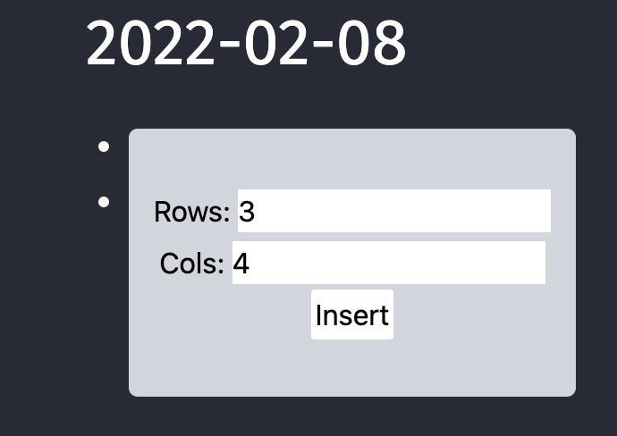
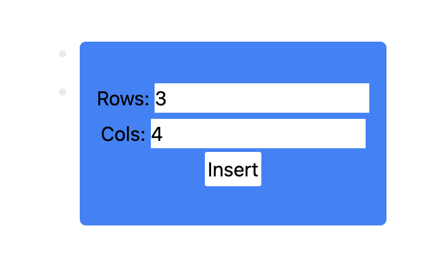

# 适配logseq主题

logseq有`light`和`dark`两种主题模式，如果我们要让我们的插件在不同主题的下显示不同的配色。主要思路是通过获得`logseq`当前的状态。并改变当前`html`所对应的`css`。


## 实现


### 在`无框架`下的实现方式

我们在之前之前写的[`renderer`组件](https://correctroad.gitbook.io/logseq-plugins-in-action/chapter-1/wei-logseq-tian-jia-ke-shi-zu-jian)上进行修改让在`dark`模式下显示红色，`light`模式下显示黑色。

修改`index.ts`

```typescript
  logseq.App.onMacroRendererSlotted(({ slot, payload} ) => {
    const [type,name,color] = payload.arguments

    // 这里是新增的代码
    const theme = top?.document
      .querySelector("html")
      ?.getAttribute("data-theme") as typeof mode) ??
      (matchMedia("prefers-color-scheme: dark").matches ? "dark" : "light");
		//
    
    if (type !== ':hello') return
    logseq.provideUI({
      key: 'hello',
      reset: true,
      slot, template: `
      <div style="background-color: ${ theme === "dark"?"red":"green" }" class="hello"
      data-block-uuid="${payload.uuid}"
      data-on-click="msg" >
        hello! ${name}
      </div>  
     `,
    })
  })
```

这段新增的代码来自`logseq-plugin-heatmap`的实现。我们这里直接借用。

修改下面组件的代码，让他判断当前的`theme`去选择`css`颜色。

现在看看效果

36.png 37.png


### 在`logseq-plugin-template-react`下的实现方式

这个手脚架自带了`windi CSS`，所以我们将用`windi CSS`实现。同时我们将参考`logseq-plugin-heatmap`的实现。

在`utils.ts`中定义我们自己的`hook`。这个`hook`包装了`logseq`的`api`。

```typescript
export const useThemeMode = () => {
  const isMounted = useMountedState();
  const [mode, setMode] = React.useState<"dark" | "light">("light");
  React.useEffect(() => {
    setMode(
      (top?.document
        .querySelector("html")
        ?.getAttribute("data-theme") as typeof mode) ??
        (matchMedia("prefers-color-scheme: dark").matches ? "dark" : "light")
    );
    logseq.App.onThemeModeChanged((s) => {
      console.log(s);
      if (isMounted()) {
        setMode(s.mode);
      }
    });
  }, [isMounted]);

  return mode;
};
```

在`App.tsx`中

```typescript
...
import { useAppVisible, useThemeMode } from "./utils";
...


function App() {
    ...
    const themeMode = useThemeMode();
  ...
  <main
          className={`absolute inset-0 ${themeMode}`}
  ...
}
```

这样当`logseq`中的主题改变时，`main`的`css`也跟着改变。把`css`写在`className`是`windi CSS`的功能。

当然这才刚刚开始，这只是`css`中标识着`dark`和`light`的值跟着`logseq`一直改变而已。我们还要为我们的页面写不同的配色的`css`。我们以第四章中的`create table`插件为例。

在`dashborad.css`中修改，对应的是你组件的`css`，`light`和`dark`对应不同颜色的背景

```css
.table-root {
    position: absolute;
    display: flex;
    width: 250px;
    height: 150px;
    border-radius: 5px;
    @apply light:bg-blue-500 dark:bg-gray-300;
}
```

这里是`windi CSS`的语法。我们在`logseq`中看看效果，不同主题成功切换了不同的配色。





ps：遇到一些`windicss`中的颜色无法使用，目前还没有找到原因。
