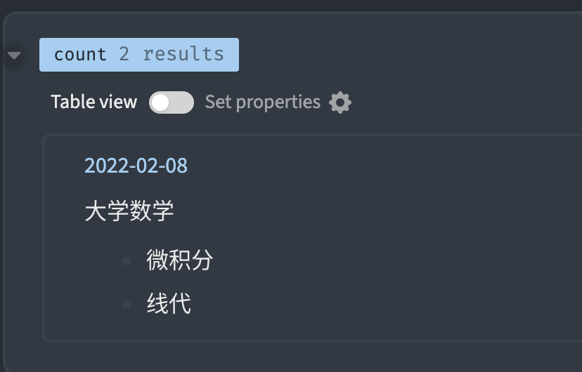
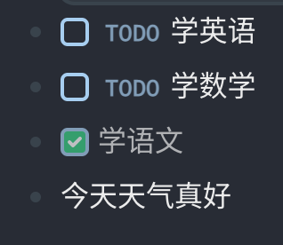
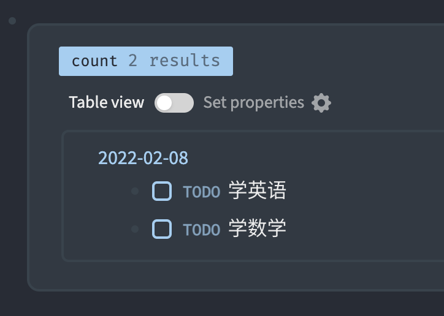

# datascript入门

### 在Logseq使用

#### 什么是匹配？

datascript是一种`匹配`查询的语言,我们从最简单的语句开始，一步一步提高直到学会\`datascript`。

什么是匹配呢？我们设想`Logseq`的数据库是长这样的

| E-id | Attribute      | Value    |
| ---- | -------------- | -------- |
| 50   | :block/parent  | 49       |
| 50   | :block/content | 大学数学 |
| 51   | :block/parent  | 50       |
| 51   | :block/content | 微积分   |
| 52   | :block/parent  | 50       |
| 52   | :block/content | 线代     |

这个表在`Logseq`中看起来是什么样的呢？是这样。微积分和线代的父节点是大学数学。


我们构造这个命令

```
[:find ?e )
    :where
     [?e :block/parent 50]]
```

`[?e :block/parent 50]`意思就是匹配所有`block`中`parent`是`50`的节点。在我们这里表里面，结果有两个，分别是`51`和`52`。那么这个`?e`就是`变量`，它的值来源于与`:block/parent 50`相匹配行的`e-id`，现在的`?e`的值是`51`、`52`。

我的logseq中微积分是72， 线代是73。

`(pull 变量名 [*])`这个`方法`的作用是把`变量名`所对应的`block`显示出来：




#### 多个匹配条件

那我们假设现在logseq的库是这样

| E-id | Attribute      | Value    |
| ---- | -------------- | -------- |
| 50   | :block/marker  | TODO     |
| 50   | :block/content | 学习英语 |
| 51   | :block/marker  | TODO     |
| 51   | :block/content | 学习数学 |
| 52   | :block/marker  | DONE     |
| 52   | :block/content | 学习语文 |

看起来像这样



```
 [:find (pull ?e [*]) 
    :where
     [?e :block/marker ?m]
     [(contains? #{"TODO"} ?m)]]
```

当匹配条件一`[?e :block/marker ?m]`执行完时，能与`:block/marker`相匹配的行有三个。 `?e`的值有三个`50`、`51`、`52` 。同时`?m`的值有`TODO`和`DONE`两个。

我们用第二个匹配条件`[(contains? #{"TODO"} ?m)]`，要求这个`?m`是在`#{"TODO"}`其中。所以`?m`是`DONE`的`52`就被排除了。现在`?e`只有`50`和`51`。上面语句执行结果就像下面这样。




未完待续...

### 在Logseq插件中使用

未完待续...


### Logseq block自带的属性

| :Namespace/Attribute | 可能的值\|示例                      |
| -------------------- | ----------------------------- |
| :block/uuid          |                               |
| :block/parent        | 50                            |
| :block/left          |                               |
| :block/collapsed?    |                               |
| :block/format        |                               |
| :block/refs          |                               |
| :block/\_refs        |                               |
| :block/path-refs     |                               |
| :block/tags          |                               |
| :block/content       |                               |
| :block/marker        | "DONE"、"TODO"、 "NOW" 、"LATER" |
| :block/priority      |                               |
| :block/properties    |                               |
| :block/pre-block?    |                               |
| :block/scheduled     |                               |
| :block/deadline      |                               |
| :block/repeated?     |                               |
| :block/created-at    | 1644037172307                 |
| :block/updated-at    | 1644037172307                 |
| :block/file          |                               |
| :block/heading-level |                               |
