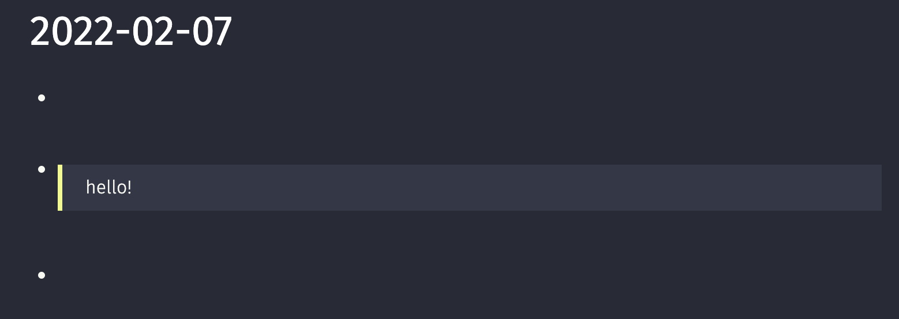
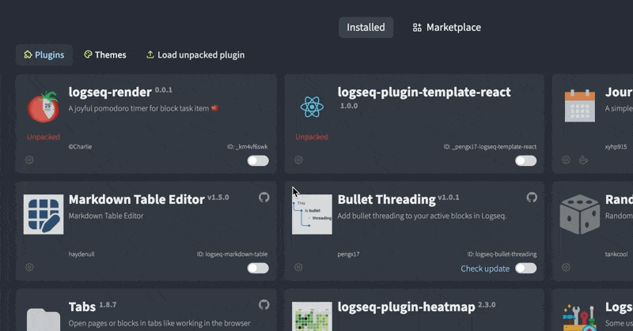
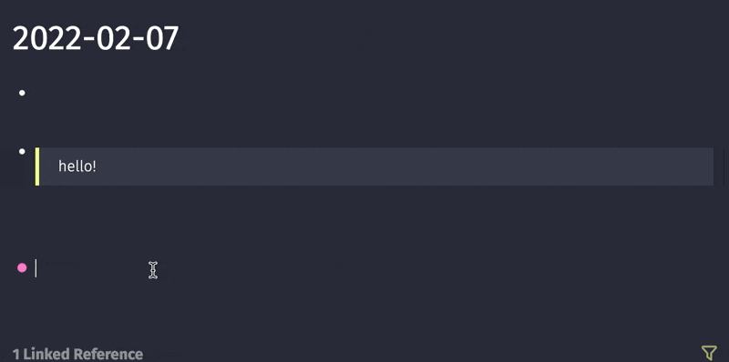
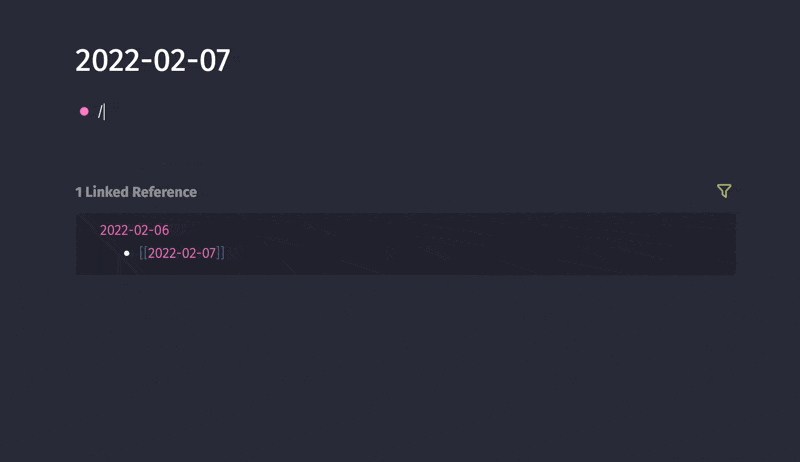

# 创建第一个logseq命令

## 起步

在`logseq`中有一系列命令是通过`/`调用的，比如`/link`、`/TODO`。现在我们为`logseq`制做一个随机引用一个句子的`命令插件`。 我使用 `logseq-emoji-picker`项目为基础，修改制做我们的`juzi`插件

## 环境搭建

`git clone https://github.com/logseq/logseq-plugin-samples.git`

使用这个命令去拉取`logseq`的官方插件示例。找到目录下的`logseq-emoji-picker`文件夹。

## 项目结构介绍

```shell
➜  logseq-emoji-picker git:(master) ✗ tree -L 1
.
├── README.md 
├── demo.gif
├── index.css 
├── index.html
├── index.ts  # 项目代码
├── logo.png  # 项目在logseq中显示的logo图片
├── package-lock.json
├── package.json # 项目在logseq中显示的名称与其它相关信息
└── yarn.lock
```

## 修改项目信息

在`package.json`中

```json
{
  "name": "logseq-emoji-picker",
  "version": "0.0.1",
  "description": "A joyful emoji picker from Logseq slash command 🚀",
  "main": "dist/index.html",
  "description": "©Charlie",
  "license": "MIT",
  "scripts": {
    "dev": "parcel ./index.html --public-url ./",
    "build": "parcel build --public-url . --no-source-maps index.html"
  },
  "devDependencies": {
    "@logseq/libs": "^0.0.1-alpha.19",
    "parcel": "^2.0.0-beta.2"
  },
  "dependencies": {
    "@joeattardi/emoji-button": "^4.6.0"  
  },
  "logseq": {
    "id": "charlie_emoji_picker_yo5bzxaca",
    "icon": "./logo.png"
  }
}
```

修改`name`、`description`、`description`、`id`等项。

并删掉 `"@joeattardi/emoji-button": "^4.6.0"` ，因为我们不需要这个`依赖`。

在该目录下运行`npm install`安装基本依赖

## 注册命令

在`logseq`的插件中，我们通过`logseq.Editor.registerSlashCommand('命令名', 异步函数)`的方法向`logseq`注册命令。

```javascript
logseq.Editor.registerSlashCommand('juzi', async () => {
	await logseq.Editor.insertAtEditingCursor( # 向logseq光标所在位置插入内容
	`#+BEGIN_QUOTE
		hello!
	 #+END_QUOTE`,
	);
})
```

其中`#+BEGIN_QUOTE something #+END_QUOTE`是`logseq`的一种引用格式，效果如下图。



修改`index.ts`

```javascript
import '@logseq/libs'

async function main () {
	logseq.Editor.registerSlashCommand('juzi', async () => {
		await logseq.Editor.insertAtEditingCursor(
		`#+BEGIN_QUOTE
			hello!
		 #+END_QUOTE`,
		);
	})
}
  
logseq.ready(main).catch(console.error)
```

然后我们在项目目录中运行`npm install && npm build`。

然后在`logseq`中的`plugins`中导入这个插件(需要开启开发者模式)。

但是logseq好像有一个bug，还需要重启logseq，命令才能加载到命令列表中。我们重启`logseq`。





成功调用该命令。

## 添加上随机获取句子能力

调用随机句子api。这里使用了`一言`的`api`。

```javascript
import '@logseq/libs'

let statement = "hello";

function getStatement(){
	fetch('https://v1.hitokoto.cn')
	.then(response => response.json())
	.then(data => {
		statement = data.hitokoto
	})
	.catch(console.error)
}
getStatement()

async function main () {
	logseq.Editor.registerSlashCommand('juzi', async () => {
		await logseq.Editor.insertAtEditingCursor(
			`#+BEGIN_QUOTE
			${statement}
			#+END_QUOTE`,
		);
	getStatement();
	})
}

logseq.ready(main).catch(console.error)
```

重新`npm build`并`reload`插件。




